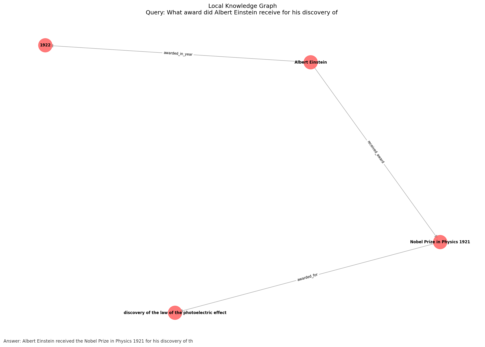

# Multimodal GraphRAG

**Query-Driven Multimodal GraphRAG** 논문(ACL 2025 Findings) 구현 및 웹 실습 인터페이스

> 질문이 들어올 때 텍스트·테이블·이미지를 통합한 로컬 지식 그래프를 동적으로 구축하고,  
> 그래프 경로를 따라 멀티홉 추론으로 답변을 생성하는 RAG 파이프라인입니다.

---

## 데모



---

## 특징

- **5단계 파이프라인** — Query Analysis → Multi-path Retrieval → Local KG Construction → Multimodal Supplement → Graph Reasoning
- **멀티모달 통합** — 텍스트·테이블·이미지를 하나의 지식 그래프로 통합
- **쿼리 주도 그래프 구축** — 전체 코퍼스를 미리 그래프화하지 않고, 질문이 들어올 때만 동적 구축
- **멀티홉 추론** — NetworkX 경로 탐색 + Claude로 근거 기반 단계별 추론
- **실시간 웹 UI** — SSE 스트리밍으로 각 단계 결과를 순서대로 시각화

---

## 파이프라인 구조

```
사용자 질문
    │
    ▼
Step 1: Query Analysis       쿼리 → Pattern Graph (엔티티·관계·모달리티 설계도)
    │
    ▼
Step 2: Multi-path Retrieval 텍스트 / 테이블 / 이미지 다중 경로 동시 검색
    │
    ▼
Step 3: Local KG Construction 검색 문서에서 트리플 추출 → 지식 그래프 구축
    │
    ▼
Step 4: Multimodal Supplement 이미지·테이블 정보를 그래프 노드에 보충
    │
    ▼
Step 5: Graph Reasoning       경로 탐색 + Claude 최종 답변 생성
```

---

## 프로젝트 구조

```
MultiRag_Project/
├── app.py                        # Flask 웹 서버 (SSE 스트리밍)
├── main.py                       # CLI 실행 파일
├── requirements.txt
│
├── src/
│   ├── pipeline.py               # 파이프라인 통합 조율
│   ├── query_analyzer.py         # Step 1: 쿼리 분석 → Pattern Graph
│   ├── retriever.py              # Step 2: 멀티모달 다중 경로 검색
│   ├── kg_builder.py             # Step 3: 지식 그래프 구축
│   ├── multimodal_supplement.py  # Step 4: 멀티모달 정보 보충
│   └── reasoner.py               # Step 5: 그래프 기반 추론
│
├── templates/
│   └── index.html                # 웹 실습 UI
│
├── data/
│   └── multimodalqa/             # 데이터셋 (없으면 내장 샘플 사용)
│
├── outputs/                      # 지식 그래프 시각화 결과
└── 학습정리.md                    # 코드 분석 포함 상세 학습 정리
```

---

## 설치 및 실행

### 1. 환경 설정

```bash
git clone https://github.com/plmnj2003/MultiRag_Project.git
cd MultiRag_Project

python -m venv venv
source venv/bin/activate          # Windows: venv\Scripts\activate

pip install -r requirements.txt
pip install flask
```

### 2. API 키 설정

```bash
cp .env.example .env              # 없으면 직접 생성
```

`.env` 파일:

```
ANTHROPIC_API_KEY=sk-ant-...
CLAUDE_MODEL=claude-sonnet-4-6
EMBEDDING_MODEL=all-MiniLM-L6-v2
```

### 3. 웹 인터페이스 실행

```bash
python app.py
# http://127.0.0.1:5000 접속
```

### 4. CLI 실행

```bash
python main.py
```

---

## 사용 방법

1. 브라우저에서 `http://127.0.0.1:5000` 접속
2. 프리셋 질문 선택 또는 직접 입력
3. **▶ 실행** 클릭
4. 5단계 파이프라인이 순서대로 실시간으로 펼쳐짐
5. 최종 답변·추론 체인·신뢰도·지식 그래프 이미지 확인

---

## 내장 샘플 데이터

데이터셋 파일 없이도 아래 주제로 바로 실습 가능합니다.

| 주제 | 포함 정보 |
|---|---|
| Albert Einstein | 생애, 노벨상 수상(1921), E=mc² |
| Marie Curie | 노벨상 2회 수상 (물리·화학) |
| Eiffel Tower | 설계자, 건축 연도, 높이, 방문객 수 |
| Apple / Steve Jobs | 창업, Pixar 투자, 재무 데이터 |
| 노벨 물리학상 | 수상자 테이블 (1903~1984) |

---

## 기술 스택

| 역할 | 라이브러리 |
|---|---|
| LLM | [Anthropic Claude](https://anthropic.com) (`claude-sonnet-4-6`) |
| 임베딩 | [sentence-transformers](https://www.sbert.net/) (`all-MiniLM-L6-v2`) |
| 그래프 | [NetworkX](https://networkx.org/) |
| 시각화 | [Matplotlib](https://matplotlib.org/) |
| 웹 서버 | [Flask](https://flask.palletsprojects.com/) |

---

## 참고 논문

> **Query-Driven Multimodal GraphRAG: Dynamic Local Knowledge Graph Construction for Online Reasoning**  
> ACL 2025 Findings

---

## 학습 자료

파이프라인 각 단계의 개념 설명과 코드 분석은 [`학습정리.md`](학습정리.md)를 참고하세요.  
AI 비전공자도 이해할 수 있도록 작성되었습니다.
